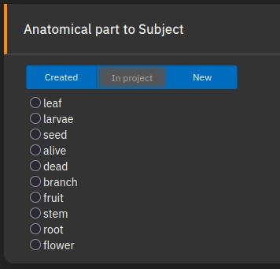
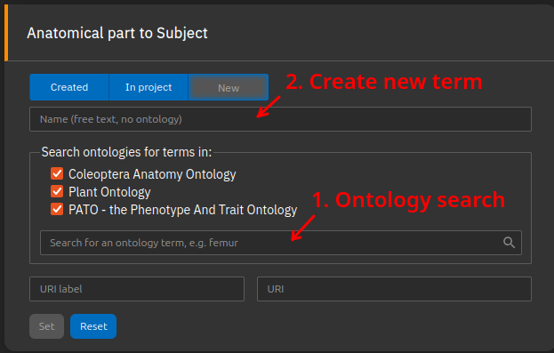
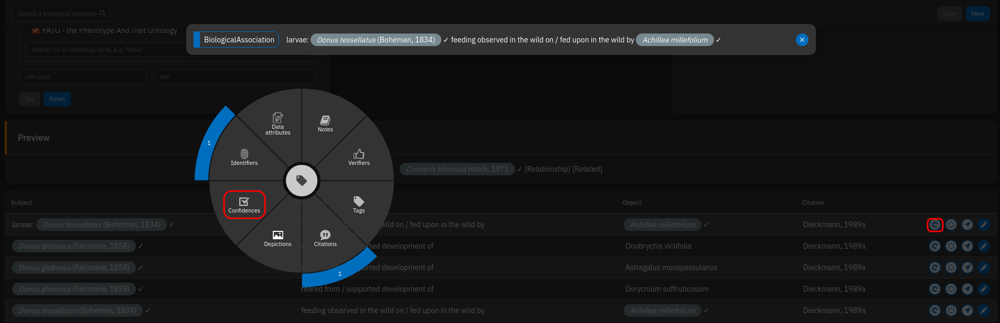
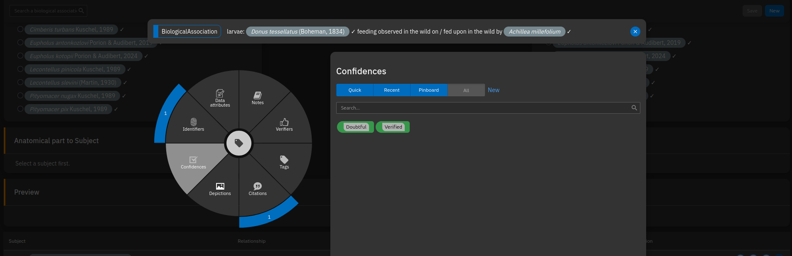

# Biological Relationships

## Preface 
### Theory
Rather than trying to represent biological reality itself, **we should record direct evidence**: For example, we use "collected from" rather than "associated with", since "collected from" states exactly what happened, without implying an evolutionary fixed relationship that can't be directly observed.  
By sticking to the evidence, we avoid common fallacies that are problematic when trying to compress complex reality into a database.
<!-- For example, an experienced entomologist may have stated that a beetle "lives on" a plant, when in fact only adult feeding on that plant was observed. Statements like "lives on" inherently include assumptions about a species behaviour that may not have been directly observed and can lead to biased interpretations.  
Interactions between larvae and plants are generally more relevant than those involving adults. They are more likely to be fixed by evolution, and the availability of suitable larval host plants is essential for reproduction, with important implications for conservation, crop protection, and species distribution.

Nevertheless, observations of adult beetles remain valuable: they can indicate where species are likely to be found and may provide indirect evidence of host–plant relationships that have not yet been formally studied. For example, repeatedly collecting adults from the same plant species can suggest a consistent feeding association.

For this reason, such statements need to be carefully evaluated and assigned to the most accurate observable category, such as "collected from" or "observed feeding in the wild on". -->

We have given considerable thought to what can actually be observed and have developed a set of terms that we believe covers most situations.

- Aggregating many observations to make generalized statements about the biology of a species is a step further down the road, so far we are only recording data.

### Biological Relationship vs Biological Association
In TaxonWorks, **Biological Relationships are definitions for interactions** that can take place between two objects (e.g., "feeds on"). **Biological associations** are concrete observations: They combine two objects by a Biological Relationship. For the objects, you can choose from:

- OTU (a species)
- CollectionObject (specimen from a collection)
- FieldOccurrence (field observation)
- AnatomicalPart (body part or life stage of a given species).

An example **Biological association** could be `Adosomus roridus` (= OTU) was `reared from` (= relationship) the `stem of Achillea millefolium` (= AnatomicalPart). Those statements can be further annotated e.g. with a citation, an asserted distribution (in France), images (of feeding marks) and many more.

### Scope: What kind of information do we want to store?
When converting data into a structured format, some information is inevitably lost. However, the database also serves as an index to the literature and other sources of evidence. Not all details are captured within TaxonWorks, but the original source can always be consulted. When entering data, you should consider the following questions:

- Was the plant merely visited, or was feeding observed? If so, was it adult or larval feeding? Was the observation made in the wild, or was the specimen collected together with plant material and examined later for feeding traces?
- Was the specimen reared? This implies that larvae were collected along with their host plant and observed until the adult beetle emerged. Rearing records provide the strongest evidence for host–plant relationships, as they constitute direct evidence for reproduction.
- Which plant part is used by the larvae or adult beetles for feeding?
- Was the specimen endophagous or exophagous?
- Is the interaction characterized by specific structures such as galls or leaf rolls?
- Where did the observation happen? (Add an asserted distribution to the biological association, or use a specimen with locality as object of the association)
- On which plant part were the adults observed sitting (optional)?
- Does the source provide general information about feeding specificity, such as mono-, oligo-, or polyphagy (optional)?

---

## List of Biological Relationships

```bio-rel
undefined relationship with | undefined relationship with
No context provided, e.g. a list entry without further information.<br>
<b>When applicable, use one of the more specific relationships below!</b>
```

```bio-rel
collected from | yielded
Used for any life stage of an organism that was simply collected from a plant (e.g., “on milkweed”). It is also applied to collection specimens whose locality labels include a plant name.<br>  
<b>When applicable, use one of the more specific relationships below!</b>
```

```bio-rel
feeding observed in the wild on | fed upon in the wild by
Used when feeding by any life stage of an organism has been observed in the wild.
```

```bio-rel
feeding observed in experimental setup on | fed upon in experimental setup by
Used when a specimen has been observed feeding on a plant in an experimental setting (e.g., larvae and plant material collected and observed in a petri dish to study feeding behavior).
```

```bio-rel
reared from | yielded by rearing
Used when the complete life cycle of a weevil has been observed, either in the wild or in an experimental setting.
```

## Life stages and plant parts

If you've observed a larvae eating on the leaf of any plant you are dealing with "anatomicalParts" in Taxonworks. Depending on if you we're talking about the beetle or the plant there are two classes:

1. lifeStage: can be larvae, egg or puppae of a beetle. Adult is considered to be default und has not be selected
2. real anatomical parts: body parts of the plant life leaf, flower bud, roots...

Even though it's clear for us, that a herb has a leaf, steam, flower bud and roots this it's not configured in Taxonworks by default. Thus everytime we want to use AnatomicalParts of a plant or beetle in a biological association, we have to create it first seperately. To do that in an easy way, you can create our reuse/ select existing anatomicalParts simultaneously with the complete biological association. To stabilize our dictionary and to avoid duplicates produced by misspelling you can use in most cases the "In project" tab. Here you find all terms which have been used within this project by now.

When you observe a larva feeding on a plant leaf, you are dealing with AnatomicalParts in TaxonWorks. Depending on whether you are referring to the beetle or the plant, there are two classes:

1. LifeStage – refers to the stage of the beetle: larva, egg, or pupa. The adult is considered the default and does not need to be selected.
2. Real anatomical parts – refers to parts of the plant, such as leaf, flower bud, or roots.

Although it is obvious that a plant has leaves, stems, flower buds, and roots, these are not preconfigured in TaxonWorks by default. Therefore, whenever you want to use AnatomicalParts for a plant or beetle in a biological association, you must create them first. To make this easier, you can create new terms or reuse/select existing anatomical parts simultaneously while entering the biological association. To stabilize our dictionary and avoid duplicates caused by misspellings, you can use the “In project” tab. This tab shows all terms that have already been used within the project.

<p align="center">
  
</p>

If you want to use a new term, you can 1. Search for terms provided by the selected ontologies or 2. create a new term if an appropriate one cannot be found:

<p align="center">
  
</p>

## Microhabitats
It is preferable to describe a microhabitat with an anatomical part only (see above). In some cases, this is not sufficient: Imagine collecting a Cossonine from the dry stem of a dead Agave plant. Using the anatomicalPart `stem of Agave sp.` would be inaccurate, the most defining feature of this habitat is that the plant is dead. In this case, add a Biological Association with *Agave* sp., and add the **data attribute "Microhabitat"** to describe it. Adding a citation to the data attribute should not be necessary, as it refers to the Biological Association that should have its own citation.

## How to use Sources/ Citations/ Literature

If the information was digitized from scientific literature, the paper or book can be cited via the “Source” panel. You are encouraged to include the exact page number, especially if the publication contains multiple pieces of information.

For personal observations without a publication, leave this field blank. Your name will automatically appear on the TaxonPages as the source.

## How do add geographic information (shapes and gazetteers)

Many host–plant relationships vary across broad geographic ranges. Therefore, it can be useful to record the location of an observation. Since the search function is not a global tool that includes all possible geographic features—such as mountains, lakes, or cities—it is often necessary to add the desired feature manually if it is not yet available. In many cases, selecting the country can serve as a first step to capture coarse geographic patterns, even if a more precise location is provided in the publication.

## Handling incorrect records
It is feasible to add published records even if you know they are incorrect. Cite the incorrect Biological Association with its orginal source. Then, via radial annotator, add a **data attribute "Reassessment"** to the Biological Association. In the "value" field, you can provide an explanation, e.g. "Refuted: based on misidentified specimens that are actually *Bagous elegans*". Try to state clearly if the record is refuted or just considered doubtful.  
Very important: **Add the source for the correction TO THE DATA ATTRIBUTE**, not the Biological Association. If there is no published source, but you as an expert know that a published record is incorrect or doubtful, create a source with you as author, optionally a year, and a title like "Personal Opinion".


<p align="center">
  
</p>

<p align="center">
  
</p>


## Tags

Similar to marking doubts, it is possible to tag specific biological information to a biological association using the radial annotator in the table below the task.

- Endophagous: larvae feed inside tissues
- Exophagous: larvae feed outside tissues
- Monophagous: according to the cited literature, this species feeds exclusively on a single plant species
- Oligophagous: according to the cited literature, this species feeds on a few closely related plant species
- Polyphagous: according to the cited literature, this species feeds on many plant species

Classifiers such as mono-, oligo-, and polyphagy cannot be automatically derived from filters when host–plant associations are strictly stored in a database, as is the case in TaxonWorks. Since this information can be very useful - for filtering data or predicting where a beetle might be found — it needs to be explicitly implemented.

## Practical limitations

Currently, our TaxonWorks instance is focused on beetles, not plants. As a result, plant species names are mostly stored as OTUs without an assigned taxon name and therefore without plant taxonomy. Many plant names have already been integrated, but many are still missing.

If a plant name is missing, you can create it while entering the biological association. To do this, simply enter random letters or numbers until the “Create new OTU” function is triggered, then enter the species name in the format “Genus species”. These names will later be matched with large taxonomy databases (e.g., Catalogue of Life) to incorporate plant taxonomy into our TaxonWorks instance.

<video controls autoplay loop muted width="400" height="421">
  <source src="assets/videos/create_otu.mp4" type="video/mp4">
  Your browser does not support the video tag.
</video>


## Preview: TaxonPages

An example can be seen on TaxonPages:

- [*Adosomus roridus* (weevil, with list of plants)](https://catalog.curculionoidea.org/#/otus/732686/overview)
- [*Achillea millefolium* (plant, with list of weevils)](https://catalog.curculionoidea.org/#/otus/735489/overview)

TaxonPages, which is a static page that displays data via the TaxonWorks API, currently has some limitations in how it presents biological relationships:

- Asserted distribution of a biological relationship is not provided (ideas: as text within the table, or on the map for the species distribution in a separate color)
- Citation for the relationship is given as short reference only, without the option to open it to see the full record with clickable links/DOI
- Under certain circumstances, plants can inherit the distribution of their insect associates
