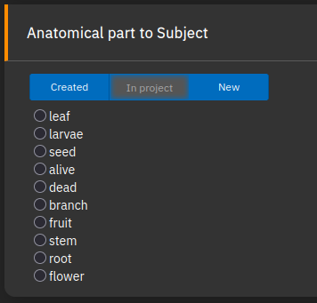
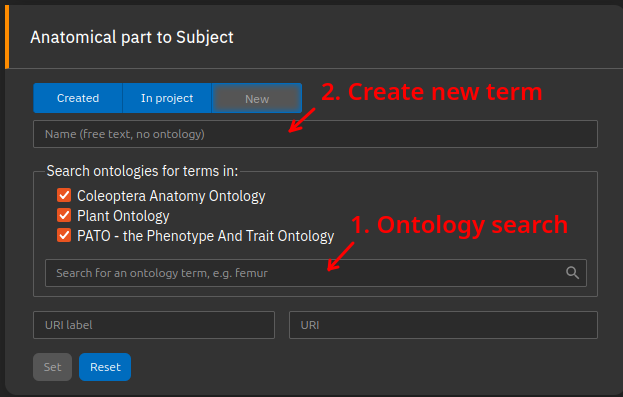

# Biological Relationships
Use the task [New biological associations II](https://sfg.taxonworks.org/tasks/biological_associations/new_ba) to have access to all features.
## Preface 
### Theory
Rather than trying to represent biological reality itself, **we should record direct evidence**: For example, we use "collected from" rather than "associated with", since "collected from" states exactly what happened, without implying an evolutionary fixed relationship that can't be directly observed.  
By sticking to the evidence, we avoid common fallacies that are problematic when trying to compress complex reality into a database.
<!-- For example, an experienced entomologist may have stated that a beetle "lives on" a plant, when in fact only adult feeding on that plant was observed. Statements like "lives on" inherently include assumptions about a species behaviour that may not have been directly observed and can lead to biased interpretations.  
Interactions between larvae and plants are generally more relevant than those involving adults. They are more likely to be fixed by evolution, and the availability of suitable larval host plants is essential for reproduction, with important implications for conservation, crop protection, and species distribution.

Nevertheless, observations of adult beetles remain valuable: they can indicate where species are likely to be found and may provide indirect evidence of host–plant relationships that have not yet been formally studied. For example, repeatedly collecting adults from the same plant species can suggest a consistent feeding association.

For this reason, such statements need to be carefully evaluated and assigned to the most accurate observable category, such as "collected from" or "observed feeding in the wild on". -->

We have given considerable thought to what can actually be observed and have developed a set of terms that we believe covers most situations.

!!! info
    Aggregating many observations to make generalized statements about the biology of a species is a step further down the road, so far we are only recording direct evidence.

### Biological Relationship vs Biological Association
In TaxonWorks, **Biological Relationships are definitions for interactions** that can take place between two objects (e.g., "feeds on"). **Biological associations** are concrete observations: They combine two objects by a Biological Relationship. For the objects, you can choose from:

- OTU (a species)
- CollectionObject (specimen from a collection)
- FieldOccurrence (field observation)
- AnatomicalPart (body part or life stage of a given species).

An example **Biological association** could be `Adosomus roridus` (= OTU) was `reared from` (= relationship) the `stem of Achillea millefolium` (= AnatomicalPart). Those statements can be further annotated e.g. with a citation, an asserted distribution (in France), images (of feeding marks) etc.

### Scope: What kind of information do we want to store?
When converting data into a structured format, some information is inevitably lost. However, the database also serves as an index to the literature and other sources of evidence. Not all details are captured within TaxonWorks, but the original source can always be consulted. When entering data, try to cover as much of the data model below as possible.

---

## Data Model
<div class="ba-model">
  <svg class="ba-model__edges" viewBox="0 0 100 100" preserveAspectRatio="none" aria-hidden="true">
    <path d="M13.9 16.67 L31 16.67 C38 16.67 39 36 46 46"/>
    <path d="M13.9 83.33 L31 83.33 C38 83.33 39 64 46 54"/>
    <path d="M86.1 12.5 L66 12.5 C60 12.5 59 34 54 46"/>
    <path d="M86.1 37.5 L66 37.5 C62 37.5 61 44 57 48"/>
    <path d="M86.1 87.5 L66 87.5 C60 87.5 59 66 54 54"/>
    <path class="ba-model__edge--main" d="M13.9 50 L40 50"/>
    <path class="ba-model__edge--main" d="M58 51 C65 51 63 62.5 69 62.5 L86.1 62.5"/>
  </svg>
  <div class="ba-model__side ba-model__side--in">
    <div class="ba-model__box ba-model__box--note">
      <strong class="ba-model__title">{radial-annotator} Tags</strong>
      <span class="ba-model__item">{keyword:Endophagous}</span>
      <span class="ba-model__item">{keyword:Exophagous}</span>
      <span class="ba-model__item">{keyword:Monophagous}</span>
      <span class="ba-model__item">{keyword:Oligophagous}</span>
      <span class="ba-model__item">{keyword:Polyphagous}</span>
      <span class="ba-model__link">0 to many</span>
    </div>
    <div class="ba-model__box ba-model__box--subject">
      <strong class="ba-model__title">Subject (Weevil)</strong>
      <span class="ba-model__hint">one of:</span>
      <span class="ba-model__item">OTU</span>
      <span class="ba-model__item">CollectionObject</span>
      <span class="ba-model__item">FieldOccurrence</span>
      <span class="ba-model__item">AnatomicalPart</span>
      <span class="ba-model__link ba-model__link--arrow">exactly 1</span>
    </div>
    <div class="ba-model__box ba-model__box--note">
      <strong class="ba-model__title">{radial-annotator} Data attributes</strong>
      <span class="ba-model__item">{predicate:Activity pattern}</span>
      <span class="ba-model__item">{predicate:Microhabitat}</span>
      <span class="ba-model__item">{predicate:Reassessment}</span>
      <span class="ba-model__link">0 to many</span>
    </div>
  </div>
  <div class="ba-model__core">
    <div class="ba-model__hex">
      <div class="ba-model__hex-in">
        <strong class="ba-model__title">Biological Relationship</strong>
        <span class="ba-model__hint">one of:</span>
        <span class="ba-model__item">see <a href="#list-of-biological-relationships">List of Biological Relationships</a></span>
      </div>
    </div>
  </div>
  <div class="ba-model__side ba-model__side--out">
    <div class="ba-model__box ba-model__box--pill">
      <strong class="ba-model__title">Citation</strong>
      <span class="ba-model__item">source, ideally with page number</span>
      <span class="ba-model__link">0 to many</span>
    </div>
    <div class="ba-model__box ba-model__box--pill">
      <strong class="ba-model__title">Asserted distribution</strong>
      <span class="ba-model__item">where the association was observed</span>
      <span class="ba-model__link">0 to many</span>
    </div>
    <div class="ba-model__box ba-model__box--object">
      <strong class="ba-model__title">Object (Plant)</strong>
      <span class="ba-model__hint">one of:</span>
      <span class="ba-model__item">OTU</span>
      <span class="ba-model__item">CollectionObject</span>
      <span class="ba-model__item">FieldOccurrence</span>
      <span class="ba-model__item">AnatomicalPart</span>
      <span class="ba-model__link ba-model__link--arrow">exactly 1</span>
    </div>
    <div class="ba-model__box ba-model__box--pill">
      <strong class="ba-model__title">{radial-annotator} Depiction</strong>
      <span class="ba-model__item">image, e.g. of feeding marks</span>
      <span class="ba-model__link">0 to many</span>
    </div>
  </div>
</div>

## List of Biological Relationships

```bio-rel
undefined relationship with | undefined relationship with
No context provided, e.g. a list entry without further information.<br>
<b>When applicable, use one of the more specific relationships below!</b>
```

```bio-rel
collected from | yielded
Used for any life stage of an organism that was simply collected from a plant (e.g., “on milkweed”). It is also applied to collection specimens whose locality labels include a plant name.<br>  
<b>When applicable, use one of the more specific relationships below!</b>
```

```bio-rel
feeding observed in the wild on | fed upon in the wild by
Used when feeding by any life stage of an organism has been observed in the wild.
```

```bio-rel
feeding observed in experimental setup on | fed upon in experimental setup by
Used when a specimen has been observed feeding on a plant in an experimental setting (e.g., larvae and plant material collected and observed in a petri dish to study feeding behavior).
```

```bio-rel
reared from | yielded by rearing
Used when the complete life cycle of a weevil has been observed, either in the wild or in an experimental setting.
```

```bio-rel
present within gall on | gall yielded
Used if larva/weevil was found within a gall, or was reared from a gall. Use an anatomical part to specify where on the plant the gall is located. Example: <b><a href="https://catalog.curculionoidea.org/#/otus/1446231/overview" target="_blank" rel="noopener"><i>Philonis inermis</i></a></b>
```


## Life stages and plant parts

If you've observed a larva eating on the leaf of any plant you are dealing with "anatomicalParts" in Taxonworks. Depending on if you we're talking about the beetle or the plant there are two classes:

1. real anatomical parts: body parts of the plants like leaf, flower bud, roots...
2. lifeStage: On weevils, we use anatomicalParts to model life stages. They can be larvae, egg or puppae of a beetle. Adult is considered to be default and does not need to be specified.

Everytime we want to use AnatomicalParts of a plant or beetle in a biological association, we have to create it first seperately. To do that in an easy way, you can create our reuse/ select existing anatomicalParts simultaneously with the complete biological association. To stabilize our dictionary and to avoid duplicates produced by misspelling you can use in most cases the "In project" tab. Here you find all terms which have been used within this project by now.

{ style="display:block;margin:0 auto" }

If you want to use a new term, you can 1. Search for terms provided by the selected ontologies or 2. create a new term if an appropriate one cannot be found:

{ style="display:block;margin:0 auto" }

## Microhabitats
Most microhabitats (like plant stem, flower etc) can be covered with anatomical parts. In some cases, this is not sufficient: Imagine collecting a Cossonine from the dry stem of a dead Agave plant. Using the anatomicalPart `stem of Agave sp.` would be inaccurate, the most defining feature of this habitat is that the plant is dead. In this case, add a Biological Association with *Agave* sp., and add the **data attribute** {predicate:Microhabitat} from the {radial-annotator} to describe it. Adding a citation to the data attribute should not be necessary, as it refers to the Biological Association that should have its own citation.

!!! info "Conventions"
    You can use this also to describe where a weevil was found, like "sitting in leaf axil". This may help others during fieldwork.

## Diel Activity/Circadian Rhythm
You can use the data attribute (from {radial-annotator}) {predicate:Activity pattern} to write something like "at daytime"

## How to use Sources/ Citations/ Literature

If the information was digitized from scientific literature, the paper or book can be cited via the “Source” panel. You are encouraged to include the exact page number, especially if the publication contains multiple pieces of information.  
If you add specimen data and there is no citation, the name of the collector of the specimen will automatically appear on the TaxonPages as the source (see e.g. *[Lixus fasciculatus](https://catalog.curculionoidea.org/#/otus/733335/overview)*).

## How do add geographic information (shapes and gazetteers)

Many host–plant relationships vary across broad geographic ranges. Therefore, the location of the observation should be recorded with an asserted distribution, or even bettere the record should be added via a specimen with exact locality, instead of the OTU. See also [Learn to create new Gazetteers](TutorialGazetteers.md)


!!! info "Conventions"
    - Be as specific as possible

## Handling incorrect records
It is feasible to add published records even if you know they are incorrect. Cite the incorrect Biological Association with its orginal source. Then, via radial annotator {radial-annotator}, add a **data attribute** {predicate:Reassessment} to the Biological Association. In the "value" field, you can provide an explanation, e.g. "Refuted: based on misidentified specimens that are actually *Bagous elegans*". Try to state clearly if the record is refuted or just considered doubtful.  
Very important: **Add the source for the correction TO THE DATA ATTRIBUTE**, not the Biological Association. If there is no published source, but you as an expert know that a published record is incorrect or doubtful, create a source with you as author, optionally a year, and a title like "Personal Opinion".

## Tags

Similar to marking doubts, it is possible to tag specific biological information to a biological association using the radial annotator {radial-annotator} in the table below the task.

- {keyword:Endophagous}: larvae feed inside tissues
- {keyword:Exophagous}: larvae feed outside tissues
- {keyword:Monophagous}: according to the cited literature, this species feeds exclusively on a single plant species
- {keyword:Oligophagous}: according to the cited literature, this species feeds on a few closely related plant species
- {keyword:Polyphagous}: according to the cited literature, this species feeds on many plant species

Classifiers such as mono-, oligo-, and polyphagy cannot be automatically derived from filters when host–plant associations are strictly stored in a database, as is the case in TaxonWorks. Since this information can be very useful - for filtering data or predicting where a beetle might be found — it needs to be explicitly implemented.

## Preview: TaxonPages

An example can be seen on TaxonPages:

- [*Adosomus roridus* (weevil, with list of plants)](https://catalog.curculionoidea.org/#/otus/732686/overview)
- [*Achillea millefolium* (plant, with list of weevils)](https://catalog.curculionoidea.org/#/otus/735489/overview)

TaxonPages, which is a static page that displays data via the TaxonWorks API, currently has some limitations in how it presents biological relationships:

- Asserted distribution of a biological relationship is not provided (ideas: as text within the table, or on the map for the species distribution in a separate color)
- Citation for the relationship is given as short reference only, without the option to open it to see the full record with clickable links/DOI
- Under certain circumstances, plants can inherit the distribution of their insect associates
