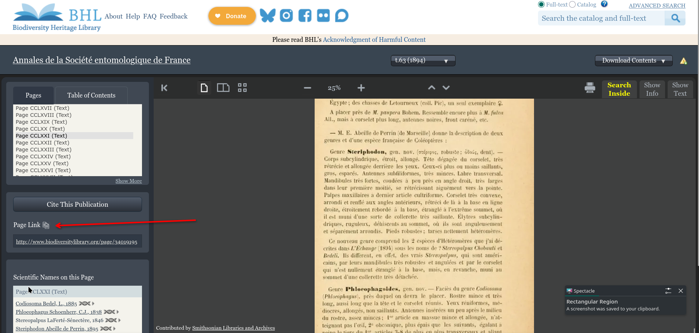

# Add a new Source without DOI, text only

<video controls loop muted>
  <source src="/docs/assets/videos/Citationwithoutdoi2.webm" type="video/webm">
  Your browser does not support the video tag.
</video>

--------------------------------------

# Add a new Source automatically with DOI via CrossRef

<video controls loop muted>
  <source src="/docs/assets/videos/citationwithdoi.webm" type="video/webm">
  Your browser does not support the video tag.
</video>

# Add URL to Biodiversity Heritage Library
Whenever possible, we try to add a URL or DOI to make sources conveniently accessible. In BHL, move to the first page of the article, then copy the page URL:
<figure markdown="span">
<figcaption>Copying the page URL on Biodiversity Heritage Library</figcaption>
  
</figure>

