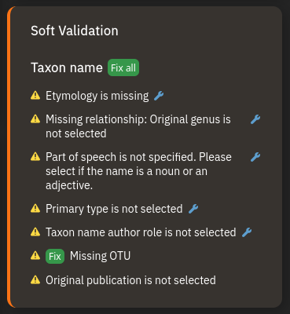

# About
Our database contains thousands of plants as OTU without a taxon name associated. Thus, they have no taxonomical hierarchy and no TaxonPage.  
OTUs need to fullfill the following requirements:

- **Taxon name assigned** (otherwise they will not have TaxonPages and no taxonomical hierarchy that is used to search, filter and summarize data)
- **OTU assigned**
- **OTU name needs to be empty** or the search bar at TaxonPages will not find the plant

## How to assign a taxon name
You can do it as usual using the "**New taxon name**" task, but it is probably quicker to use "**Assign taxon name to OTU**". This task can import taxon names from Catalogue of Life, importing them together with their parent taxonomical hierarchy. Very convenient!
<video controls autoplay loop muted>
  <source src="assets/videos/TutorialCuratePlants/Assign taxon name to OTU.webm" type="video/webm">
  Your browser does not support the video tag.
</video>

## Adding the species name
<video controls autoplay loop muted>
  <source src="assets/videos/TutorialCuratePlants/SynchronizeTaxonNames.webm" type="video/webm">
  Your browser does not support the video tag.
</video>
{ align=right }

