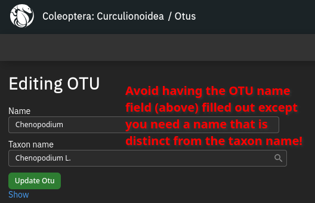
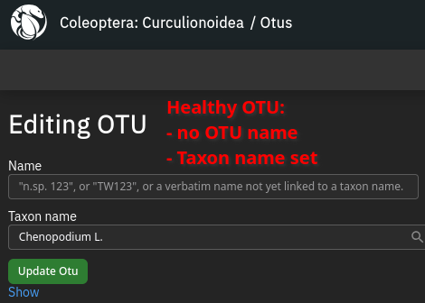
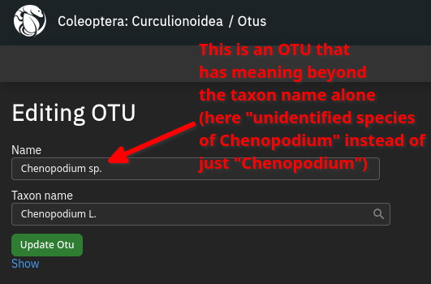
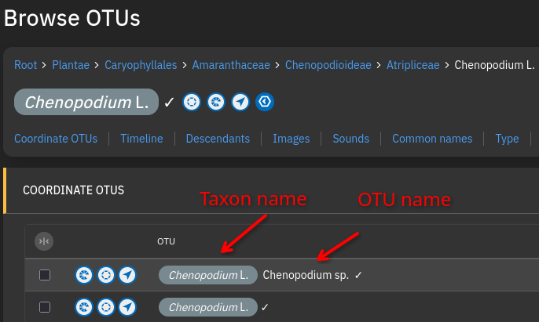

# About
Our database contains thousands of plant taxa as bare OTU, without a taxon name associated. Without a taxon name, those OTU have no taxonomical hierarchy and cannot have their own page on TaxonPages.  
A healthy entry for a taxon should fullfill the following requirements:

- **Taxon name** (OTU without taxon name are invisible on TaxonPages and lack taxonomical hierarchy, that is used to search, filter and summarize data)
- **At least one OTU per taxon name**
- **At least one OTU per taxon name without OTU name** or the search bar at TaxonPages will not find the name

## How to assign a taxon name
You can do it as usual using the "**New taxon name**" task, but it is probably quicker to use "**Assign taxon name to OTU**". This task can import taxon names from Catalogue of Life, importing them together with their parent taxonomical hierarchy. Very convenient!  
From the list (alphabetical, several pages), click the magnifying glass to start searching for a taxon name. The search will go through three stages: TaxonWorks, TaxonWorks (fuzzy matching), Catalogue of Life.  
The name will be imported along with names that are part of parent hierarchy.  
**Important: You have to delete the OTU name (keeping only the taxon name) from the OTU, otherwise it will not be found by the search bar on TaxonPages!** 
<video controls autoplay loop muted>
  <source src="/docs/assets/videos/TutorialCuratePlants/AssignTaxonNameToOTU.webm" type="video/webm">
  Your browser does not support the video tag.
</video>
(In the video, I am opening the "Browse OTU" page for Populus tremula by clicking the OTU name with my mouse wheel)
If no data is associated with a plant OTU, I delete it to keep the database clean.

## Adding OTU to the batch-imported parent taxon names
If you import something like *Populus tremula*, its parent names like genus *Populus* etc will also be imported if not already present. Those will be **Taxon names without OTU**. Damn! Luckily it is only a few clicks to add OTUs to all valid taxon names without an OTU. They will be fine right away, no need to remove an OTU name.
<video controls autoplay loop muted>
  <source src="/docs/assets/videos/TutorialCuratePlants/SynchronizeTaxonNames.webm" type="video/webm">
  Your browser does not support the video tag.
</video>

## Why do I need to remove the OTU name?
If both the "Name" field and the "Taxon name" field are filled out for an OTU, this will exclude it from the Search Bar results on TaxonPages.  

### When do I use an OTU name?
Sometimes you may need a name for a taxon that is not its scientific name. Think "Chenopodium sp." or "Chenopodium spp." or "Salix spp. with lanceolate leaves", all of which could be useful for biological associations.
You can create as many OTU as you like for the same taxon name. **OTU with identical taxon name will be "connected" with each other.** Just make sure that exactly one of them has the name field empty. This is your primary OTU, the others are additional OTU for specific purposes.  
**Avoid OTU without taxon name!**
**One OTU per taxon name should have no OTU name!**
**Don't forget that all taxon names should have an OTU!**  

